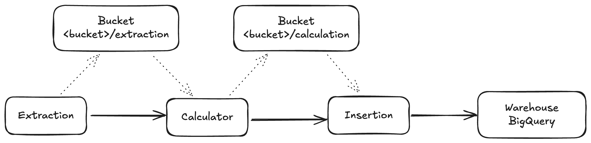

# Sequence Pipeline Architecture

* Latest update: 2024-11-08

Sequence pipeline processes data from the given data sources (GCP bucket) to a data warehouse table (BigQuery), transform and load the data into a table using Go. Its extract, normalize, and calculate daily marketplace volume, daily transactions, and aggregated volume data, and send it to an API endpoint for data visualization.

## Overview



### Storage

The pipeline reads data from the following sources:

- **GCP**: Google Cloud Storage (GCS) bucket.
- **API**: CoinGecko API as a data source for the exchange rate.
- **Filesystem**: Local file system for testing purposes.

### Warehouse

The pipeline writes data to the following destination:

- **GCP**: BigQuery.
- **Print**: Print the data to the console for testing purposes.

### Data Processing

The pipeline performs the following tasks:

- **Extraction**: Read data from the GCS bucket and normalize the data.
- **Calculator**: Calculate daily marketplace volume, daily transactions, and aggregated volume data.
- **Insertion**: Load the transformed data into BigQuery.

The pipeline can be executed simultaneously in a single run or split across multiple runs. The pipeline can be also configurable to use different storage such as `filesystem` or `bucket` to load the data to process or to save the output of the step in case they are run across multiple runs. The pipeline can be also configurable to use different warehouse such as `BigQuery` or `Print` to save the output of the step.


### Data Structure

[big_query_table.sql](resources/big_query_table.sql)

```bigquery
CREATE TABLE IF NOT EXISTS `sequence.sample_data` (
    date DATE,
    project_id STRING,
    num_transactions INT64,
    total_volume_usd FLOAT64
) OPTIONS (
    expiration_timestamp = TIMESTAMP '2024-11-15 00:00:00 UTC',
    description = 'sample data for sequence expire 2024-11-15',
);
```

## Package Structure

```markdown
|
├── cmd # contains application executable.
├── internal # contains application specific non-reusable by any other projects code
│   ├── conversor # contains conversors implementation for the application, used to convert values between currencies.
│   ├── entities # contains entities provides the data structures (domain) used in the application.
│   ├── mocks # contains mocks for testing.
│   ├── storage # contains storage providers implementation for the application, used to save or to load intermediate step data.
│   ├── warehouse # contains warehouse providers implementation for the application.
├── pkg # MUST NOT import internal packages. Packages placed here should be considered as vendor.
│   ├── makefiles # contains Makefile modules.
├── resources # RECOMMENDED service resources. Shell helper scripts, additional files required for development, testing and documentations.
```


